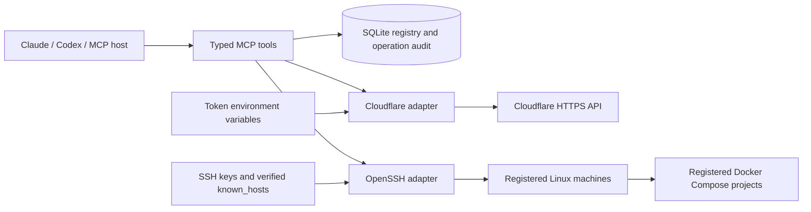

# Cloudflare Compose MCP

**Manage Cloudflare accounts and Docker Compose over SSH from your AI assistant.**

Ready for local **Claude Desktop, Claude Code and Codex** use. **ChatGPT requires a separate authenticated remote deployment**; see the [client setup guide](docs/clients.md) for the exact compatibility boundary.

| Client | v0.1.0 support |
| --- | --- |
| Claude Desktop | Local stdio configuration included |
| Claude Code | Local stdio; setup command documented |
| Codex | Local stdio and plugin manifest included |
| ChatGPT / claude.ai | Requires a remote transport and authentication layer; not bundled |

[Client setup](docs/clients.md) · [Credential handling](SECURITY.md) · [MIT license](LICENSE)

A local/self-hosted MCP connector for multiple Cloudflare account profiles and Docker Compose projects on SSH machines. Implemented in Python with the official MCP SDK (v1 maintenance line, pinned below v2), SQLite, HTTPX and OpenSSH. The connector uses stdio; it does not expose a network listener.

## Architecture



A **profile** binds a friendly name to one Cloudflare account ID and an environment variable holding its token. A **machine** holds a host, port, SSH user and references to local authentication files. A **project** binds a machine to an existing remote Compose file, project directory and explicit Docker project name. Every operation selects its target; there is no mutable global current account or machine.

Cloudflare and SSH are independent adapters. A machine can host workloads for several accounts without owning those accounts. A future deployment entity can link a profile, zone, tunnel, machine and project; that orchestration is deliberately separate from the individual operations because DNS and container changes cannot form one atomic transaction.

## Included tools

| Area | Tools / behavior |
|---|---|
| Registry | `inventory`, `profile_add`, `machine_add`, `project_add` |
| SSH | `machine_check` verifies connection and Compose version |
| Compose | `compose_run`: status, logs, validate, pull, up, stop, restart, down |
| Account | `cloudflare_account` retrieves selected account |
| Zones | `cloudflare_zones` lists account-scoped zones |
| DNS | `cloudflare_dns_list`, `cloudflare_dns_write` create/update/delete A, AAAA, CNAME, TXT, MX |
| Tunnels | `cloudflare_tunnels`, `cloudflare_tunnel_create` for remotely managed tunnels |

List tools return one page and Cloudflare pagination metadata. Request subsequent pages explicitly. Registration rejects duplicate names. Profile and machine edit/delete tools are not included in this version.

## Local setup

Requires Python 3.11+, the OpenSSH client, and Linux remote machines with Docker Compose v2 installed. Install from source:

```bash
git clone https://github.com/adgsenpai/cloudflare-compose.git
cd cloudflare-compose
python3 -m venv .venv
.venv/bin/pip install -e '.[dev]'
.venv/bin/pytest -q
```

The included `.mcp.json` starts `.venv/bin/python -m cloudflare_compose.server` from the plugin directory. For another MCP host, configure that absolute interpreter path and arguments. Supply token variables securely in the server process environment; `.env` files are not automatically loaded. No credentials are included in this repository.

Use `CF_COMPOSE_HOME` to override the registry directory (default `~/.local/share/cloudflare-compose`). Persist this directory across process/container restarts. SQLite contains metadata and operation outcomes, not token values or private keys. Keep both the state directory and credential files accessible only to the connector's operating-system user.

Example tool arguments, with illustrative values:

```json
{"profile":"work","account_id":"0123456789abcdef0123456789abcdef","token_env":"CF_WORK_TOKEN"}
```

```json
{"machine":"production","host":"server.example.com","user":"deploy","identity_file":"/home/you/.ssh/deploy_ed25519","known_hosts":"/home/you/.ssh/known_hosts","port":22}
```

Verify the server host fingerprint through a trusted channel before adding it to `known_hosts`. The connector never automatically accepts new host keys. SSH configuration files are disabled so per-host local shell commands and implicit forwarding settings cannot alter execution. Encrypted keys require an already-unlocked matching SSH agent identity; interactive password prompts are disabled.

```json
{"project":"website","machine":"production","directory":"/srv/website","compose_file":"/srv/website/compose.yaml","project_name":"website"}
```

Then call `machine_check`, `compose_run` with `validate`, and `compose_run` with `status`. For a deployment, call `compose_run` with `up` to preview, then repeat with `execute: true` to apply the reviewed operation.

Cloudflare token permissions depend on the tools used: Account Settings Read for account details, Zone Read for zone listing/ownership checks, DNS Read/Edit for records, and Cloudflare Tunnel Read/Edit for tunnels. Restrict tokens to their intended account and zones. DNS calls verify zone ownership against the selected profile even when the token spans multiple accounts.

## Self-hosted container

`Dockerfile` packages the same stdio server. Build with `docker build -t cloudflare-compose .`. Run it under an MCP host using `docker run --rm -i`, mounting persistent state at `/state`, a dedicated key and known_hosts read-only under `/credentials`, and supplying token environment variables. The container runs as UID 10001: mounted files must be readable by that UID and `/state` writable. Do not mount the Docker socket; the connector controls remote Docker through SSH. There is no HTTP port to publish.

## Operational boundaries

This is a single trusted operator connector, not a multi-tenant service. All clients attached to this process have the same infrastructure authority. Registry paths and credential references are configuration, not isolation from the operating-system user. SSH/Docker access is highly privileged; use a dedicated account and only register trusted Compose files. Compose files can request powerful host access even though this connector provides no arbitrary shell tool.

Mutations default to a preview. `execute: true` is an explicit execution flag, not a cryptographic approval or protection against an untrusted MCP client. The MCP host remains responsible for its authorization workflow. Registry additions write only local metadata. Remote commands are constructed from a fixed action set with shell-quoted arguments; no raw command execution, sudo, volume deletion, file upload or Compose YAML editing tool is exposed.

Operations have a 120-second SSH deadline and a 32 KiB returned-output limit. Capture is file-backed and can consume temporary disk space until the deadline. Timeout means unknown remote completion, not rollback. Inspect state before retrying a mutation; creates are not automatically retried. Concurrent operations on the same project are not serialized: callers must sequence them. Audit rows record start and outcome, never output; they are local operational history, not tamper-proof compliance logs. Remote logs can contain application secrets and are returned as-is.

Tunnel support currently lists and creates tunnels only. Installing `cloudflared`, delivering its token, configuring ingress, deleting tunnels and linking DNS are separate administrative steps. NGINX can be managed as a service in a registered Compose project; generating or editing NGINX configuration is not implemented. No real infrastructure is provisioned during setup or testing.

## Next architecture increments

1. Deployment records that bind a hostname, profile/zone, tunnel, machine and Compose project.
2. A durable job queue with per-project locks, progress, cancellation semantics and reconciliation after interrupted runs.
3. Host-side credential delivery and tunnel ingress validation, keeping tunnel tokens out of chat.
4. Registry editing with revision checks and dependency-aware deletion.
5. For shared remote use: authenticated Streamable HTTP, per-user authorization, encrypted secret storage, and separate execution workers. Do not expose this stdio service through an unauthenticated HTTP bridge.

## Verification

The test suite covers registry persistence, duplicate registration, filesystem permissions, path validation, shell quoting, SSH options, mutation previews, audit records, account isolation, API error redaction, DNS writes, SSH timeout handling and a real stdio MCP handshake. Unit tests use mocked Cloudflare/SSH services and do not need credentials.

```bash
.venv/bin/pytest -q
```

A GitHub Actions workflow runs the suite on Python 3.11 and 3.13. Local live checks have also exercised the account, zone, tunnel and DNS read tools and SSH/Compose availability; private test data is not included. The container recipe and remote ChatGPT deployment have not been validated end-to-end.

## References

- [Official MCP Python SDK v1](https://py.sdk.modelcontextprotocol.io/v1/)
- [Cloudflare API](https://developers.cloudflare.com/api/overview/)
- [Cloudflare DNS record API](https://developers.cloudflare.com/api/resources/dns/subresources/records/methods/create/)
- [Cloudflare Tunnel setup](https://developers.cloudflare.com/tunnel/get-started/)
- [Docker Compose CLI](https://docs.docker.com/reference/cli/docker/compose/)
